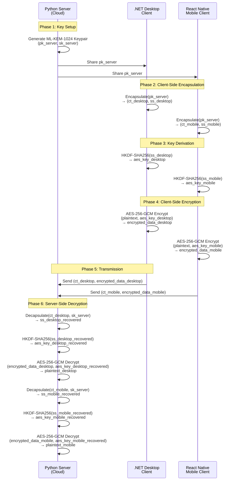

# System Architecture - QuantumSafe-XCryptor

## 🏗️ Architecture Overview

QuantumSafe-XCryptor is a post-quantum hybrid encryption system. In the current serverless demo flow:

1. **.NET CLI** generates/loads ML-KEM-1024 keypairs, encapsulates, derives AES-256, encrypts the sample, and emits artifacts to `/data`.
2. **Python CLI** loads the private key, decapsulates the ML-KEM-1024 ciphertext, derives the same AES-256 key, and decrypts the packet from `/data`.
3. **React Native** remains a client-side encrypt/decrypt reference (not used in the serverless compose run).

Exchange happens over a shared volume (`./shared` mounted as `/data`), not HTTP. Artifacts written by .NET for Python to consume:
- `kyber_public.key`, `kyber_private.key`
- `kyber_ciphertext.bin` (ML-KEM-1024 ciphertext)
- `encrypted-dotnet.bin` ([ML-KEM-1024 ciphertext][AES nonce + ciphertext + tag])
- `decrypted-dotnet.txt` (local verification)

Python CLI uses `kyber_ciphertext.bin` + private key (or the ciphertext within `encrypted-dotnet.bin`) to recover the shared secret, derive AES-256 via HKDF-SHA256, and decrypt to `decrypted-python.txt`.

```
┌──────────────────────────────────────────────────────────────────┐
│          Post-Quantum Hybrid Encryption Architecture             │
│              ML-KEM-1024 (KEM) + AES-256-GCM (AEAD)               │
└──────────────────────────────────────────────────────────────────┘

┌─────────────────────────┐
│   Python Cloud Server   │
│  (Kyber Key Generator)  │
│  ✓ Generate Keypairs    │
│  ✓ Publish Public Key   │
│  ✓ Decrypt Files        │
│  ✓ Maintain Private Key │
└────────────┬────────────┘
             │
      ┌──────┴──────┐
      │             │
      ▼             ▼
┌──────────────┐ ┌──────────────────┐
│  .NET        │ │  React Native    │
│  Desktop     │ │  Mobile          │
│  Client      │ │  Client          │
│              │ │                  │
│ ✓ Encaps     │ │ ✓ Encaps         │
│ ✓ Derive Key │ │ ✓ Derive Key     │
│ ✓ Encrypt    │ │ ✓ Encrypt        │
│ ✓ Send Data  │ │ ✓ Send Data      │
└──────────────┘ └──────────────────┘
```

## 📊 System Workflow Diagram



## 🔐 Detailed Encryption Flow

### Server-Side (Python) - Key Generation Phase

```
Python Server (Cloud)
├─ Generate ML-KEM-1024 Keypair
│  ├─ Public Key (pk_server): 1568 bytes
│  └─ Private Key (sk_server): 3168 bytes [KEEP SECURE]
│
├─ Publish Public Key to Clients
│  ├─ → Share with .NET Desktop
│  └─ → Share with React Native Mobile
│
└─ Store Private Key Securely
   └─ Use environment variables or HSM
```

### Client-Side (Desktop & Mobile) - Encryption Phase

```
Desktop (.NET) / Mobile (React Native)
├─ Receive Server's Public Key (pk_server)
│
├─ Encapsulate Shared Secret
│  ├─ Input: pk_server
│  ├─ Output: 
│  │  ├─ Kyber Ciphertext (ct_client): 1568 bytes
│  │  └─ Shared Secret (ss_client): 32 bytes
│  └─ Implementation:
│     ├─ .NET: LibOqsKyber.Encapsulate()
│     └─ React Native: @noble/post-quantum Kyber.encapsulate()
│
├─ Derive AES-256 Key
│  ├─ Input: Shared Secret (ss_client)
│  ├─ Function: HKDF-SHA256
│  │  ├─ Salt: 32 zero bytes
│  │  ├─ Info: "AES-256-GCM"
│  │  └─ Output Length: 32 bytes
│  ├─ Output: AES Key (aes_key_client): 32 bytes
│  └─ Implementation:
│     ├─ .NET: KyberHelper.DeriveAesKey() [Manual HMAC implementation]
│     ├─ React Native: deriveAesKey() [crypto-browserify]
│     └─ Result: aes_key_client is IDENTICAL on all platforms
│
├─ Encrypt File Data
│  ├─ Input: Plaintext + aes_key_client
│  ├─ Function: AES-256-GCM
│  │  ├─ Generate 12-byte random nonce
│  │  ├─ Encrypt plaintext
│  │  ├─ Compute 16-byte authentication tag
│  │  └─ Output format: [nonce:12][ciphertext][tag:16]
│  └─ Implementation:
│     ├─ .NET: AesGcmHelper.Encrypt()
│     └─ React Native: encryptFile() [react-native-aes-crypto]
│
├─ Prepare Transmission Packet
│  ├─ Packet: [Kyber Ciphertext (ct_client) | AES-Encrypted Data]
│  ├─ Format Details:
│  │  ├─ Kyber ciphertext: 1568 bytes
│  │  ├─ Nonce: 12 bytes
│  │  ├─ AES ciphertext: variable (same size as plaintext)
│  │  └─ Auth tag: 16 bytes
│  └─ Total overhead: ~1600 bytes per file
│
└─ Send Encrypted Packet to Server
   └─ Over secure channel (HTTPS/TLS)
```

### Server-Side (Python) - Decryption Phase

```
Python Server (Cloud)
├─ Receive Encrypted Packet
│  ├─ Extract: Kyber Ciphertext (ct_client)
│  └─ Extract: AES-Encrypted Data
│
├─ Decapsulate Shared Secret
│  ├─ Input: ct_client + sk_server
│  ├─ Function: Kyber Decapsulate
│  │  └─ Recover: Shared Secret (ss_client_recovered): 32 bytes
│  ├─ Why private key is essential:
│  │  ├─ Ciphertext alone does NOT reveal the shared secret
│  │  ├─ Only holder of private key can recover it (IND-CCA2 security)
│  │  └─ This ensures forward secrecy
│  └─ Implementation: oqs.KeyEncapsulation("ML-KEM-1024", secret_key=sk_server)
│
├─ Derive AES-256 Key (IDENTICAL to Client)
│  ├─ Input: ss_client_recovered (same as client's ss_client)
│  ├─ Function: HKDF-SHA256 with IDENTICAL parameters
│  │  ├─ Salt: 32 zero bytes [SAME]
│  │  ├─ Info: "AES-256-GCM" [SAME]
│  │  └─ Output Length: 32 bytes [SAME]
│  ├─ Output: aes_key_recovered (MUST equal client's aes_key_client)
│  └─ Implementation: derive_aes_key() [cryptography library]
│
├─ Decrypt File Data
│  ├─ Input: AES-Encrypted Data + aes_key_recovered
│  ├─ Function: AES-256-GCM Decrypt
│  │  ├─ Extract nonce: first 12 bytes
│  │  ├─ Extract ciphertext: middle bytes
│  │  ├─ Extract tag: last 16 bytes
│  │  ├─ Verify authentication tag
│  │  └─ Decrypt and return plaintext
│  ├─ Authentication check:
│  │  ├─ If tag matches → plaintext is authentic & confidential
│  │  └─ If tag fails → data was tampered, reject immediately
│  └─ Implementation: AESGCM.decrypt()
│
└─ Output: Original Plaintext
   └─ Decrypted content available for processing/storage
```

## 📦 Cryptographic Components

### ML-KEM-1024 (NIST-Approved Post-Quantum KEM)

```
┌──────────────────────────────────────────────────┐
│         CRYSTALS-Kyber (NIST PQC Standard)       │
├──────────────────────────────────────────────────┤
│ Security Level: 5 (256-bit quantum security)     │
│ Algorithm: Module-Learning-With-Errors (LWE)    │
│ Lattice-based cryptography                      │
│                                                  │
│ Key Sizes:                                       │
│  ├─ Public Key (pk):     1568 bytes              │
│  ├─ Private Key (sk):    3168 bytes [SENSITIVE] │
│  ├─ Ciphertext (ct):     1568 bytes              │
│  └─ Shared Secret (ss):    32 bytes              │
│                                                  │
│ Use Case: Quantum-resistant key encapsulation   │
│ Properties:                                      │
│  ├─ IND-CCA2 secure                             │
│  ├─ Forward secrecy (new pk for each message)  │
│  ├─ Resistant to quantum attacks                │
│  └─ Deterministic for given inputs              │
└──────────────────────────────────────────────────┘
```

### HKDF-SHA256 (Key Derivation Function)

```
┌──────────────────────────────────────────────────┐
│  HMAC-based Key Derivation Function (RFC 5869)   │
├──────────────────────────────────────────────────┤
│ Hash Function: SHA-256                           │
│ Two-phase process:                               │
│                                                  │
│ Phase 1: Extract (normalize input)               │
│  └─ PRK = HMAC(salt, input_key_material)        │
│                                                  │
│ Phase 2: Expand (generate output)                │
│  └─ OKM = HMAC(PRK, info || counter) || ...     │
│                                                  │
│ Configuration for AES-256-GCM:                   │
│  ├─ Input: 32-byte Kyber shared secret           │
│  ├─ Salt:  32 zero bytes (0x00...00)            │
│  ├─ Info:  "AES-256-GCM" (UTF-8)                │
│  └─ Output: 32 bytes (AES-256 key)              │
│                                                  │
│ Why HKDF?                                        │
│  ├─ Derives cryptographically strong keys       │
│  ├─ Provides domain separation via 'info'       │
│  ├─ Platform-agnostic (pure HMAC-SHA256)        │
│  └─ Identical output across all implementations  │
└──────────────────────────────────────────────────┘
```

### AES-256-GCM (Authenticated Encryption)

```
┌──────────────────────────────────────────────────┐
│    Advanced Encryption Standard (AES-256)        │
│              Galois/Counter Mode (GCM)           │
├──────────────────────────────────────────────────┤
│ Key Size:    256 bits (32 bytes)                 │
│ Block Size:  128 bits (16 bytes)                 │
│ Nonce Size:  96 bits (12 bytes) [per message]   │
│ Tag Size:    128 bits (16 bytes) [authentication]
│                                                  │
│ Encryption Process:                              │
│  1. Generate random 12-byte nonce               │
│  2. Encrypt plaintext with AES-256-CTR          │
│  3. Compute GHASH authentication tag             │
│  4. Output: [nonce:12][ciphertext][tag:16]      │
│                                                  │
│ Decryption Process:                              │
│  1. Extract nonce, ciphertext, tag               │
│  2. Verify authentication tag                    │
│  3. If valid, decrypt ciphertext                 │
│  4. If invalid, reject immediately               │
│                                                  │
│ Properties:                                      │
│  ├─ AEAD (Authenticated Encryption w/ AD)       │
│  ├─ Provides confidentiality AND authenticity   │
│  ├─ Timing-resistant (no early-fail on tag)     │
│  └─ Prevents tampering detection                │
└──────────────────────────────────────────────────┘
```

## 🛡️ Security Properties

### Why This Architecture Works

```
┌───────────────────────────────────────────────────────────────┐
│                   Multi-Layer Security Stack                  │
├───────────────────────────────────────────────────────────────┤
│ Layer 4: Quantum Resistance (ML-KEM-1024)                       │
│  └─ Protects against future quantum computer attacks          │
│                                                               │
│ Layer 3: Key Encapsulation (Per-Client Shared Secrets)        │
│  └─ Each client gets unique shared secret (forward secrecy)   │
│                                                               │
│ Layer 2: Key Derivation (HKDF-SHA256)                         │
│  └─ Derives strong AES keys from Kyber secrets                │
│  └─ Ensures identical key derivation across platforms         │
│                                                               │
│ Layer 1: Authenticated Encryption (AES-256-GCM)              │
│  └─ Confidentiality (encryption) + Authenticity (tag)         │
│  └─ Detects any tampering with ciphertext                    │
│                                                               │
│ Layer 0: Transport Security (TLS/HTTPS)                       │
│  └─ Protects Kyber ciphertexts in transit                    │
│  └─ Not rely on alone; defense-in-depth                      │
└───────────────────────────────────────────────────────────────┘
```

### Threat Model & Protection

```
Threat                          Protection
─────────────────────────────────────────────────────────────
Quantum Computer Attack    →     ML-KEM-1024 lattice hardness
(future threat)

Passive Eavesdropping      →     AES-256-GCM encryption
(ciphertext interception)        IND-CPA security

Active Tampering          →      AES-GCM authentication tag
(ciphertext modification)        Detects & rejects modified data

Key Recovery from CT      →      Kyber IND-CCA2 security
(only ciphertext available)      Private key required for recovery

Replay Attack             →      Fresh nonce per encryption
(reuse same ciphertext)          Randomized encapsulation

Cross-Platform Mismatch   →      Unified HKDF parameters
(different AES keys)             Identical derivation on all platforms

Server Private Key Exposure →    Automatic key rotation
(compromised sk_server)          Generate new keypair, notify clients

Per-Client Secrets        →      Unique shared secret per client
(no shared key, fresh keying)    Kyber fresh ct for each client
```

## 🔑 Key Management Strategy

```
Python Server (Cloud):
├─ Generate & Store Private Key (sk_server)
│  ├─ Store in secure environment (env vars, HSM, vault)
│  ├─ Never transmit to clients
│  ├─ Rotate periodically (recommend: annually)
│  └─ Backup securely (encrypted, offline)
│
├─ Publish Public Key (pk_server)
│  ├─ Distribute via secure channel (HTTPS)
│  ├─ Clients cache locally
│  ├─ Include expiration date
│  └─ Publish new pk_server on key rotation
│
└─ Maintain Key Log
   ├─ Track all encapsulations received
   ├─ Log decryption operations
   └─ Alert on unusual patterns

Desktop (.NET) Client:
├─ Retrieve Server's Public Key
│  ├─ Download via HTTPS
│  ├─ Verify signature or pin certificate
│  ├─ Cache for offline operation
│  └─ Periodically refresh
│
└─ Never Store Server Private Key
   └─ Only use server's public key

Mobile (React Native) Client:
├─ Same as Desktop Client
└─ Bonus: Can use device secure storage (Keychain/Keystore) for local keys
```

## 🌐 Cross-Platform Interoperability

The critical requirement is that **all three platforms derive the EXACT same AES key** from the Kyber shared secret.

### HKDF Parameter Alignment

```
Platform            Kyber Backend          HKDF Implementation
────────────────────────────────────────────────────────────
.NET Desktop        liboqs (native)        cryptography.hazmat.HKDF
                                          + Manual HMAC-SHA256

React Native Mobile @noble/post-quantum    crypto-browserify (HMAC)
                    (WASM)

Python Server       liboqs (native)        cryptography.hazmat.HKDF
```

### Key Derivation Must Be Identical

```
Algorithm:   HKDF-SHA256 (RFC 5869)
Salt:        32 zero bytes (0x00 * 32)  [IDENTICAL]
Info:        "AES-256-GCM" (UTF-8)       [IDENTICAL]
Input Key:   Kyber shared secret (32 bytes) [from decap_secret()]
Output Len:  32 bytes                    [for AES-256]

Result: aes_key_platform_1 === aes_key_platform_2 === aes_key_platform_3
```

### Verification

To ensure cross-platform compatibility:

1. **Generate reference vectors** in one language (e.g., Python)
2. **Test all platforms** decrypt reference ciphertexts
3. **Implement unit tests** comparing derived keys
4. **Version control** the HKDF parameters (no silent changes)

Example test vector:
```
Input Shared Secret (hex):   [32 bytes from Kyber]
Expected AES Key (hex):      [computed by reference implementation]
.NET Result:                 [must match expected]
React Native Result:         [must match expected]
Python Result:               [must match expected]
```

## 📊 Performance & Overhead Analysis

```
Operation                  Time (approx)    Data Size      Notes
────────────────────────────────────────────────────────────────
ML-KEM-1024 KeyGen         ~0.5 ms          4,736 bytes   Server-side once
ML-KEM-1024 Encapsulate    ~1 ms            1,568 bytes   Per client upload
ML-KEM-1024 Decapsulate    ~1 ms            32 bytes      Per decryption
HKDF-SHA256                <1 ms            32 bytes      Deterministic
AES-256-GCM Encrypt        ~500 µs/MB       +28 bytes     Per MB of data
AES-256-GCM Decrypt        ~500 µs/MB       (same)        Per MB of data
────────────────────────────────────────────────────────────────
Total Encryption Overhead  ~1600 bytes per file (Kyber CT + nonce + tag)
Total Time (1MB file)      ~2 ms            +1,600 bytes  Desktop/Mobile
Total Time (1MB file)      ~2 ms            32 bytes      Server (already has key)
```

### Bandwidth Overhead

```
Per File Upload:
  ML-KEM Ciphertext: 1,568 bytes (one-time per unique client)
  AES Nonce:         12 bytes    (per file)
  AES-GCM Tag:       16 bytes    (per file)
  ─────────────────────────────
  Total Overhead:    1,596 bytes (worst case)
                     28 bytes    (per additional file, same client)

For a 1 MB file:
  Encryption time:  ~2 ms (client-side)
  Network payload:  1 MB + 1,596 bytes = 1.0015 MB
  Storage:          ~0.16% overhead
```

## 🎯 Use Cases & Deployment Scenarios

### 1. **Enterprise Secure File Storage**
- Desktop employees encrypt files locally using server's public key
- Files uploaded to cloud server with quantum-safe encryption
- Server decrypts with private key for processing/storage
- No keys shared; server-centric model

### 2. **Mobile-Cloud Synchronization**
- User encrypts sensitive data on mobile device
- Syncs encrypted data to cloud server
- Server stores encrypted blobs, decrypts on-demand
- Each device gets unique Kyber ciphertext

### 3. **Multi-Device Workflow**
- Desktop: Create encrypted file → Upload to server
- Mobile: View same encrypted file → Decrypt locally → Edit → Re-upload
- Server: Never sees plaintext; always has ciphertexts from different devices

### 4. **Secure Backup & Archival**
- Desktop/Mobile: Encrypt files before backup
- Server: Store encrypted backups indefinitely
- Restore: Download encrypted file → Decrypt locally
- Post-quantum safety for data with long retention requirements

### 5. **Healthcare/Finance Compliance**
- HIPAA/PCI compliance: Encrypt before transmission
- Server never has keys to decrypt (zero-knowledge architecture)
- Audit log: Track which clients encrypted what
- Future-proof: Resistant to quantum attacks (harvest-now-decrypt-later)

## 🔬 Implementation Checklist

### Python Server

- [ ] Generate ML-KEM-1024 keypair on startup
- [ ] Store private key securely (environment variable / HSM)
- [ ] Expose public key via HTTPS endpoint (`/api/kyber/public-key`)
- [ ] Implement decapsulation endpoint (`/api/kyber/decrypt-file`)
  - Input: Kyber ciphertext + encrypted AES data
  - Output: Plaintext (or error if tag verification fails)
- [ ] Implement HKDF-SHA256 key derivation with exact parameters
- [ ] Implement AES-256-GCM decryption with tag verification
- [ ] Add error handling for invalid ciphertexts/tags
- [ ] Implement periodic key rotation (generate new pk/sk)
- [ ] Log all decryption operations (audit trail)

### .NET Desktop Client

- [ ] Download server's public key on startup
- [ ] Implement Kyber encapsulation using liboqs
- [ ] Implement HKDF-SHA256 with identical parameters to server
- [ ] Implement AES-256-GCM encryption
- [ ] Build file upload UI (drag-drop or file picker)
- [ ] Send to server: `(kyber_ciphertext, aes_encrypted_data)`
- [ ] Display encryption status and upload progress
- [ ] Cache server's public key (with refresh logic)
- [ ] Unit test: Ensure derived AES keys match Python

### React Native Mobile Client

- [ ] Download server's public key on app startup
- [ ] Integrate @noble/post-quantum for Kyber
- [ ] Implement crypto-browserify HKDF-SHA256
- [ ] Implement react-native-aes-crypto encryption
- [ ] Build file selection UI (native file picker)
- [ ] Handle permissions (storage access)
- [ ] Send to server via secure HTTP
- [ ] Display encryption status
- [ ] Implement offline mode (cache public key)
- [ ] Unit test: Verify AES key derivation matches others

## 🧪 Testing & Validation

### Cross-Platform Key Derivation Test

```python
# Reference implementation (Python)
shared_secret = b"..." # 32 bytes from Kyber
expected_aes_key = derive_aes_key(shared_secret)  # hex string

# .NET test
var sharedSecret = new byte[32] { ... };
var aesKey = KyberHelper.DeriveAesKey(sharedSecret);
Assert.AreEqual(expectedAesKeyHex, Convert.ToHexString(aesKey));

// React Native test
const sharedSecret = Buffer.from([...]);
const aesKey = await deriveAesKey(sharedSecret);
expect(aesKey.toString('hex')).toBe(expectedAesKeyHex);
```

### End-to-End Encryption Test

```
1. Server generates keypair, publishes pk
2. Desktop: Encapsulate(pk) → (ct_d, ss_d) → aes_d = HKDF(ss_d) → encrypt
3. Mobile: Encapsulate(pk) → (ct_m, ss_m) → aes_m = HKDF(ss_m) → encrypt
4. Server receives (ct_d, encrypted_d) and (ct_m, encrypted_m)
5. Server: Decapsulate(ct_d) → ss_d → aes_d = HKDF(ss_d) → decrypt
6. Server: Decapsulate(ct_m) → ss_m → aes_m = HKDF(ss_m) → decrypt
7. Verify: plaintext_d == plaintext_m (same original message)
```

## 📚 Configuration & Constants

```python
# Shared across all platforms
KYBER_PUBLIC_KEY_SIZE = 1568    # bytes
KYBER_PRIVATE_KEY_SIZE = 3168   # bytes (server only)
KYBER_CIPHERTEXT_SIZE = 1568    # bytes
KYBER_SHARED_SECRET_SIZE = 32   # bytes

# HKDF Parameters (MUST be identical)
HKDF_HASH_ALGORITHM = "SHA-256"
HKDF_SALT = b'\x00' * 32        # 32 zero bytes
HKDF_INFO = b"AES-256-GCM"      # UTF-8 string
HKDF_OUTPUT_LENGTH = 32         # bytes (for AES-256)

# AES-GCM Configuration
AES_KEY_SIZE = 32               # bytes (256 bits)
AES_NONCE_SIZE = 12             # bytes (96 bits, recommended for GCM)
AES_TAG_SIZE = 16               # bytes (128 bits)

# Network/Protocol
SERVER_PUBLIC_KEY_ENDPOINT = "https://server.example.com/api/kyber/public-key"
SERVER_DECRYPT_ENDPOINT = "https://server.example.com/api/files/decrypt"
SERVER_UPLOAD_ENDPOINT = "https://server.example.com/api/files/upload"
```

This architecture provides **post-quantum security** with a clear division of responsibility:
- **Server**: Key generation, storage, decryption (trusted anchor)
- **Clients**: Encryption, secure transmission (zero-knowledge upload)
- **Network**: No plaintext in transit, only ciphertexts and Kyber CTs
